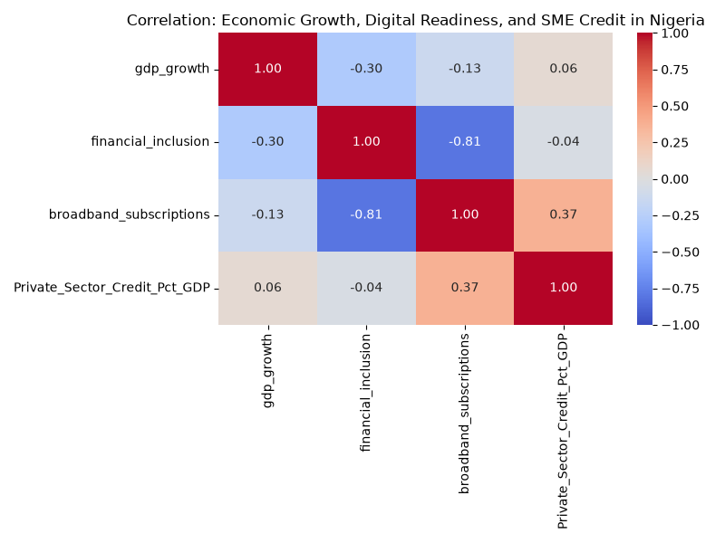

# The Impact of AI on Economic Growth & Financial Inclusion in Nigeria
**A Macro-Level Analysis of Digital Readiness and SME Credit Access**

---

## The Core Problem
- **SMEs Drive the Economy**: SMEs account for ~50% of Nigeria's GDP and over 80% of employment.
- **The Credit Gap**: Access to finance is the #1 obstacle for SME growth (SMEDAN).
- **The Traditional Barrier**: Lack of collateral and formal credit history leaves millions "invisible" to traditional banks.

---

## The AI Opportunity
- **Alternative Credit Scoring**: Machine learning can use non-traditional data (mobile usage, utility payments) to assess credit risk.
- **The Prerequisite**: Successful AI deployment requires robust digital readiness and foundational infrastructure (e.g., broadband).

**Question**: Does an improvement in digital readiness actually correlate with better SME credit access in Nigeria?

---

## Methodology & Data
- **Data Source**: World Bank Open Data (historical time-series).
- **Proxies Used**:
  - *AI/Digital Readiness* = Fixed Broadband Subscriptions.
  - *SME Financial Inclusion* = Domestic Credit to Private Sector (% of GDP).
  - *Macroeconomic Impact* = Annual GDP Growth.
- **Analysis**: Pearson Correlation Matrix.

---

## Key Findings: The Data Speaks

### 1. Digital Infrastructure Drives Inclusion
- A **moderate positive correlation (0.37)** exists between broadband adoption and private sector credit access.
- **Takeaway**: Better tech foundations allow financial systems to serve more SMEs.

---

## Key Findings: The Macro Disconnect
### 2. The GDP Lag Effect
- A slightly negative correlation (-0.13) exists between short-term GDP growth and digital readiness.
- **Why?**
  - Nigeria's GDP remains highly susceptible to volatile oil prices.
  - Tech adoption yields productivity gains with a "lag effect," not instantaneous macroeconomic surges.

---

## Policy Recommendations

1. **Accelerate Foundational Infrastructure**: Expand broadband beyond Lagos and Abuja to ensure equitable AI access.
2. **Promote AI in FinTech**: The CBN should create "sandbox" environments for FinTechs utilizing AI for alternative credit scoring.
3. **Develop Ethical AI Frameworks**: Implement localized guidelines to prevent algorithmic bias against rural or marginalized populations.

---

# Thank You
**Questions & Discussion**
